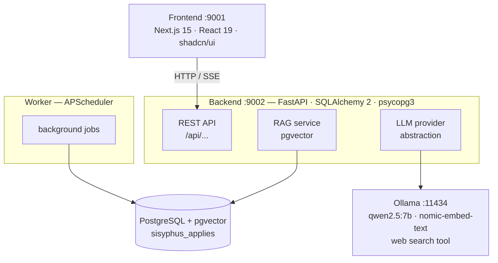

# Sisyphus Applies

A local-first, single-user job search tracker with an embedded AI assistant. Runs fully offline with a local Ollama model, or connects to a more capable cloud agent (Codex / ChatGPT) when you need it — your choice.

Built during a job search, for a job search — and as a demonstration of what I can put together when left to my own devices with AI.


---

## Why "Sisyphus"

In Greek myth, Sisyphus is condemned to roll a boulder up a hill for eternity — only to watch it tumble back down, and begin again.

Job searching feels exactly like that. You craft the resume, tailor the cover letter, submit the application. You wait. You hear nothing, or you hear *no*. You start over. The boulder never stays at the top.

This app does not fix that. It just gives Sisyphus a clipboard.

It tracks every company you've researched, every application you've sent, every status change, every document — so that the repetition at least has a record. The AI assistant helps you analyze job postings, research companies, and write cover letters. The boulder still rolls back down. But now you know exactly how many times you've pushed it.

---

## Features

**Job search tracking**
- Companies and applications with a full status history and transition graph
- Document storage — attach CVs and cover letters to applications
- Dashboard with application timeline, stats, and recent activity

**The Oracle** (AI assistant, `/oracle` tab)
- Ask questions about job postings — paste text or give a URL to scrape
- Answers draw on your own stored data via **RAG** (Retrieval-Augmented Generation)
- **Web search** via tool use (DuckDuckGo) for live company research
- **Streaming responses** — text appears token-by-token via SSE
- **Cover letter generation** from application data
- **Provider abstraction** — `ollama` for fully local inference, `codex` for Codex CLI (requires ChatGPT subscription); any other CLI agent that reads stdin and writes stdout can be wired in via the same interface

**Developer tooling**
- **Feature memory** — a "Carve it in" button floats on every page; clicking it lets you describe a feature idea and captures a full-page screenshot, saved to the database. The `/features` tab lists all open entries. "Let it roll" archives an entry once shipped. Exists so that when working with an AI on a new task, you can hand it a screenshot + description of the current state and skip the "explain the UI from scratch" step.

**AI infrastructure**
- Embeddings with `nomic-embed-text` stored in **pgvector**
- Automatic indexing of applications, companies, and uploaded documents on save
- Startup check indexes any records that were missed
- Reindex button in the UI

---

## Architecture



**Three processes run together:**
- **Frontend** — Next.js dev server at `http://localhost:9001`
- **Backend** — FastAPI + Alembic at `http://127.0.0.1:9002`
- **Worker** — APScheduler background jobs

---

## Tech stack

| Layer        | Technology                       | Why                                             |
|--------------|----------------------------------|-------------------------------------------------|
| Frontend     | Next.js 15, React 19, TypeScript | App Router, Server Components, type safety      |
| UI           | Tailwind CSS, shadcn/ui          | Consistent design system, no runtime CSS        |
| Backend      | FastAPI, Python 3.12             | Async-first, automatic OpenAPI, type hints      |
| ORM          | SQLAlchemy 2 + psycopg3          | Typed queries, async sessions, pgvector support |
| Migrations   | Alembic                          | Schema versioning, auto-generate from models    |
| Database     | PostgreSQL + pgvector            | Relational + vector search in one place         |
| LLM runtime  | Ollama                           | Local model serving with tool use and streaming |
| Embeddings   | nomic-embed-text                 | 768-dim, fast, runs on CPU or GPU               |
| Web scraping | Playwright                       | JavaScript-rendered pages                       |

---

## Prerequisites

- **Python 3.12+**
- **Node.js 18+**
- **PostgreSQL 14+**
- **Ollama** — [ollama.com](https://ollama.com)

---

## Quick start

### 1. Clone and set up

```bash
git clone https://github.com/newander/sisyphus-applies.git
cd sisyphus-applies
./scripts/setup.sh          # Linux / macOS
.\scripts\setup.ps1         # Windows (PowerShell)
```

The setup script checks prerequisites, creates `.env` from `.env.example`, installs Python and Node dependencies, applies database migrations, and optionally seeds demo data.

Edit `.env` if your PostgreSQL credentials differ from the defaults (`postgres/postgres` on `localhost:5432`).

### 2. Set up the AI components

```bash
./scripts/setup-ai.sh
```

Installs Ollama, pulls `qwen2.5:7b` and `nomic-embed-text`, enables the `pgvector` extension.

### 3. Run

```bash
./scripts/start-all.sh      # Linux / macOS
.\scripts\start-all.ps1     # Windows
```

Opens at **http://localhost:9001**

---

## Configuration

Key `.env` variables:

```dotenv
# LLM provider: "ollama" (local, no account needed) or "codex" (Codex CLI, requires ChatGPT subscription)
# Any CLI agent that reads a prompt from stdin and streams text to stdout can be added the same way.
LLM_PROVIDER=ollama
OLLAMA_BASE_URL=http://localhost:11434
OLLAMA_MODEL=qwen2.5:7b
OLLAMA_EMBED_MODEL=nomic-embed-text
OLLAMA_NUM_CTX=32768

# Web search via DuckDuckGo tool use
WEB_SEARCH_ENABLED=true
```

---

## Development

```bash
# Backend (with auto-reload)
.venv/bin/uvicorn backend.main:app --host 127.0.0.1 --port 9002 --reload --reload-dir backend

# Frontend
cd frontend && npm run dev

# Migrations
make alembic-upgrade
make alembic-revision m="describe change"

# Lint
.venv/bin/ruff check backend/
cd frontend && npm run lint

# Tests
.venv/bin/pytest backend/tests/
```

---

## License

[MIT](LICENSE)
